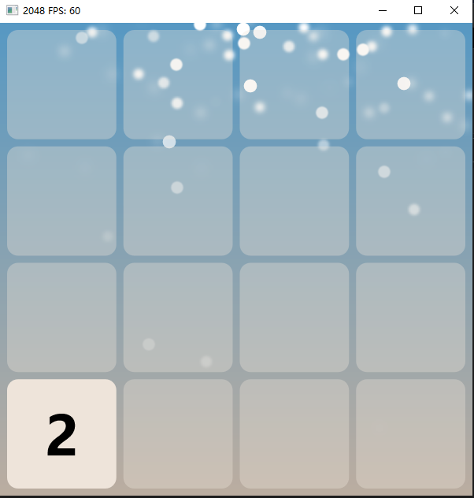

# D2D-2048


C++ 版2048，使用`Direct2D`绘制





## 项目结构


```
├─D2D2048_v3.sln	# 主工程文件
└─D2D2048_v3
    ├─main.cpp		# 游戏入口
    ├─include		# 依赖的其它库文件
    │  ├─GameEngine	# 用 Direct2d 封装的简单的游戏引擎
    │  ├─httplib	# httplib 库，通过 http-get 请求远程获取一些配置、检查更新，httplib是阻塞的，为了不阻塞游戏的运行，搭配 线程池 使用
    │  └─nlohmann	# json 库，用来解析上面 http-get 请求的 json 数据，因为配置是用 json 写的
    │
    └─src			# 游戏一些其他的文件
       ├─Board.cpp	# 棋盘类
       ├─Snow.cpp   # Snow类，一个小彩蛋
       └─Thread_pool.cpp	# 一个线程池，用来在游戏运行时异步处理 http 请求
```


该项目用到了httplib库请求一个网页，网页有一些游戏配置信息，请求的网页为：[http://songshu007.gitee.io/backstage/2048/](http://songshu007.gitee.io/backstage/2048/)，只是白嫖Gitee的Pages服务搭的，由于数据是`json`格式，需要`nlohmann`库解析json数据


另外，我用`Python`的`Flask`框架搭建了一个简单的后台，玩家游玩的时长和胜利次数都可以在这里：[http://117.50.181.42:4000/backstage/2048](http://117.50.181.42:4000/backstage/2048) 看到，这个就不开源了，因为太简单了，丢人啊哈哈哈

## 日志

## v5.1    24/1/16

- 添加鼠标滑动来进行游戏的操作

## v5.0    23/1/10

- 删除匪夷所思的 NetWorkUpdata 类，为了异步处理阻塞操作，新增了 Thread_pool类 -> 一个简单的线程池
- 添加了世界排行榜，地址：http://117.50.181.42:4000/backstage/2048
- 重新添加修改棋盘大小的选项
- 重新添加右小键盘的控制支持

## v4.0

- 添加了远程后台用来检测更新，棋盘的下雪和背景颜色现在可以远程自定义
- 砍了许多菜单项，以后会添加回来，提示：按“H”键可以看到按键设置
- 重构整个棋盘类
- 图标被我搞没了，以后再加回来
- 重构GameEngine，现在GameEngine是单线程的，多线程现在有一些问题

## v2.5

优化动画效果

## v2.4

新增多种缓动动画，动画速度调节

## v2.3

修复了在高DPI设备上界面缩放的问题

## v2.1

修复了稳定性问题